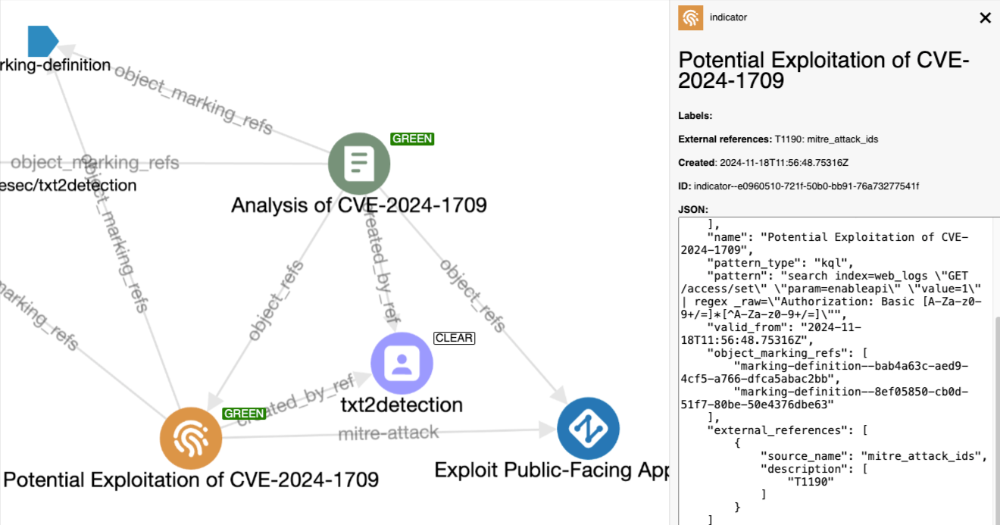

# txt2detection

## Overview



A command line tool that takes a txt file containing threat intelligence and turns it into a detection rule.

## The problems

To illustrate the problem, lets walk through the current status quo process a human goes through when going from idea (threat TTP) to detection rule:

1. read and understand threat using their own research, aided by external sources (blogs, intel feed, etc.)
  * problems: lots of reports, threats described in a range of ways, reports contain differing data
2. understand what logs or security data can be used to detect this threat
  * problems: log schemas are unknown to analyst, TTPs often span many logs making it hard to ensure your detection rule has full coverage
3. convert the logic created in step 1 into a Sigma detection rule to search logs identified at step 2
  * problems: hard to convert what has been understood into a logical detection rule (in a detection language an analyst might not be familiar with)
4. modify the detection rule based on new intelligence as it is discovered
  * problems: this is typically overlooked as people create and forget about rules in their detection tools

## The solution

Use AI to process threat intelligence, create and keep them updated.

txt2detection allows a user to enter some threat intelligence as a file to considered be turned into a detection.

1. User uploads intel report
2. Based on the user input, AI prompts structured and sent to produce an intelligence rule
3. Rules converted into STIX objects

## tl;dr

[](https://www.youtube.com/watch?v=uJWXYKyu3Xg)

[Watch the demo](https://www.youtube.com/watch?v=uJWXYKyu3Xg).

## Usage

### Setup

Install the required dependencies using:

```shell
# clone the latest code
git clone https://github.com/muchdogesec/txt2detection
cd txt2detection
# create a venv
python3 -m venv txt2detection-venv
source txt2detection-venv/bin/activate
# install requirements
pip3 install -r requirements.txt
pip3 install .
```

### Set variables

txt2detection has various settings that are defined in an `.env` file.

To create a template for the file:

```shell
cp .env.example .env
```

To see more information about how to set the variables, and what they do, read the `.env.markdown` file.

### Run

```shell
python3 txt2detection.py
```

There are 2 ways in which you can use txt2detection, either starting with a text file / text string or with an existing Sigma Rule.

#### File / Text Input

Use this mode to generate a set of rules from an input text file;

* `--input_file` (required, if not using `--input_text`, file path): the file to be converted. Must be `.txt`
* `--input_text` (required, if not using `--input_file`, string): a text string that will be analysed to create a rule by the AI if you don't want to use a file.
* `--name` (required): name of file, max 72 chars. Will be used in the STIX Report Object created. Note, the Indicator object names/titles are generated by AI
* `--report_id` (optional, default random uuidv4): Sometimes it is required to control the id of the `report` object generated. You can therefore pass a valid UUIDv4 in this field to be assigned to the report. e.g. passing `2611965-930e-43db-8b95-30a1e119d7e2` would create a STIX object id `report--2611965-930e-43db-8b95-30a1e119d7e2`. If this argument is not passed, the UUID will be randomly generated.
* `--tlp_level` (optional, default `clear`): Options are `clear`, `green`, `amber`, `amber_strict`, `red`.
* `--labels` (optional): comma seperated list of labels. Case-insensitive (will all be converted to lower-case). Allowed `a-z`, `0-9`. e.g.`"namespace.label1","label_2"` would create 2 labels. Added to both report and indicator objects created and the rule `tags`. You can also use namespac
  * note: you cannot use reserved namespaces `cve.`, `tlp.` or `attack.` when creating labels
* `--created` (optional, `YYYY-MM-DDTHH:MM:SS.sssZ`): by default all object `created` times will take the time the script was run. If you want to explicitly set these times you can do so using this flag. Pass the value in the format `YYYY-MM-DDTHH:MM:SS.sssZ` e.g. `2020-01-01T00:00:00.000Z`
* `--use_identity` (optional, default txt2detection identity): can pass a full STIX 2.1 identity object (make sure to properly escape). Will be validated by the STIX2 library. The ID is used to create the Indicator and Report STIX objects, and is used as the `author` property in the Sigma Rule.
* `--license` (optional): [License of the rule according the SPDX ID specification](https://spdx.org/licenses/). Will be added to the rule.
* `--reference_urls` (optional): A list of URLs to be added as `references` in the Sigma Rule property and in the `external_references` property of the Indicator and Report STIX object created. e.g `"https://www.google.com/" "https://www.facebook.com/"`
* `--status` (optional, default `experimental`): either `stable`, `test`, `experimental`, `deprecated`, `unsupported`
* `--external_refs` (optional): txt2detection will automatically populate the `external_references` of the report object it creates for the input. You can use this value to add additional objects to `external_references`. Note, you can only add `source_name` and `external_id` values currently. Pass as `source_name=external_id`. e.g. `--external_refs txt2stix=demo1 source=id` would create the following objects under the `external_references` property: `{"source_name":"txt2stix","external_id":"demo1"},{"source_name":"source","external_id":"id"}`
* `ai_provider` (required): defines the `provider:model` to be used to generate the rule. Select one option. Currently supports:
    * Provider (env var required `OPENROUTER_API_KEY`): `openrouter:`, providers/models `openai/gpt-4o`, `deepseek/deepseek-chat` ([More here](https://openrouter.ai/models))
    * Provider (env var required `OPENAI_API_KEY`): `openai:`, models e.g.: `gpt-4o`, `gpt-4o-mini`, `gpt-4-turbo`, `gpt-4` ([More here](https://platform.openai.com/docs/models))
    * Provider (env var required `ANTHROPIC_API_KEY`): `anthropic:`, models e.g.: `claude-3-5-sonnet-latest`, `claude-3-5-haiku-latest`, `claude-3-opus-latest` ([More here](https://docs.anthropic.com/en/docs/about-claude/models))
    * Provider (env var required `GOOGLE_API_KEY`): `gemini:models/`, models: `gemini-1.5-pro-latest`, `gemini-1.5-flash-latest` ([More here](https://ai.google.dev/gemini-api/docs/models/gemini))
    * Provider (env var required `DEEPSEEK_API_KEY`): `deepseek:`, models `deepseek-chat` ([More here](https://api-docs.deepseek.com/quick_start/pricing))

#### Sigma rule input

Use this mode to turn a Sigma Rule into a STIX bundle and get it enriched with ATT&CK and Vulmatch.

Note, in this mode you should be aware of a few things;


* `--sigma_file` (required, file path): the sigma rule .yml you want to be processed. Must be a `.yml` or `.yaml` file. Does not currently support correlation rules.
* `--created` (optional, `YYYY-MM-DDTHH:MM:SS.sssZ`): by default the `data` and `modified` values in the rule will be used. If no values exist for these, the default behaviour is to use script run time. You can pass  `created` time here which will overwrite `date` and `modified` date in the rule

You cannot pass the following arguments if using Sigma file

* `report_id`: the rule ID is used for both Indicator and report
* `name`: the `title` of the rule will be used for this
  * note, `title` in rule is required, if rule has not title the input will error
* `license`: the `license` value in the rule will be used
* `reference_urls`: the `references` in the rule will be used

You can enter any of the following values, not

### Output

The output of each run is structured as follows;

```txt
.
├── logs
│   ├── log-<REPORT UUID>.log
│   ├── log-<REPORT UUID>.log
│   └── log-<REPORT UUID>.log
└── output
    └── bundle--<REPORT UUID>
        ├── rules
        │   ├── rule--<UUID>.yml
        │   └── rule--<UUID>.yml
        ├── data.json # AI output, useful for debugging
        └── bundle.json # final STIX bundle with all objects
```

## Examples

See `tests/manual-tests/README.md` for some example commands.

## Support

[Minimal support provided via the DOGESEC community](https://community.dogesec.com/).

## License

[Apache 2.0](/LICENSE).